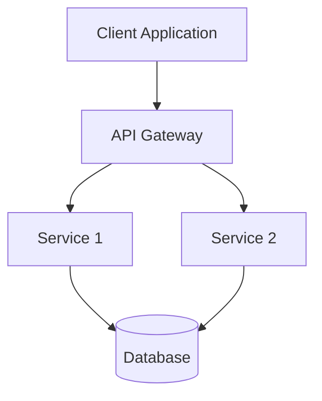

## Project Structure & Organization
This was generated off a python project.

### Core Directory Layout

```
project-root/
├── src/                    # Source code directory
│   ├── api/               # API layer (routes, controllers, handlers)
│   ├── core/              # Core business logic and domain models
│   ├── services/          # Service layer (business logic, external integrations)
│   ├── utils/             # Shared utilities and helpers
│   └── cli/               # Command-line interface (if applicable)
├── tests/                 # Test directory
│   ├── unit/              # Unit tests (mirrors src/ structure)
│   ├── integration/       # Integration tests
│   └── e2e/              # End-to-end tests (if applicable)
├── architecture/          # Architecture documentation
├── infra/                 # Infrastructure configuration
│   ├── docker/           # Docker configurations
│   ├── terraform/        # Infrastructure as Code
│   ├── helm/             # Kubernetes Helm charts
│   └── k8s/              # Kubernetes manifests
├── docs/                  # Project documentation
├── scripts/               # Build and deployment scripts
└── config/                # Configuration files
```

### Naming Conventions

#### Files and Directories
- Use **kebab-case** for directory names: `user-service/`, `api-gateway/`
- Use **snake_case** for file names: `user_service.py`, `api_routes.rs`
- Use **PascalCase** for class names: `UserService`, `ApiController`
- Use **camelCase** for function and variable names: `getUserById`, `apiEndpoint`

#### Module Organization
- Group related functionality in dedicated modules
- Use `__init__.py` (Python) or `mod.rs` (Rust) for module definitions
- Separate concerns: API, business logic, data access, utilities

## Build & Development Tooling

### Essential Build Files

#### Makefile Structure
```makefile
.PHONY: help setup install build run tests clean package

help:
	@echo "Usage:"
	@echo "  make setup      - Set up development environment"
	@echo "  make install    - Install dependencies"
	@echo "  make build      - Build project"
	@echo "  make run        - Run application"
	@echo "  make tests      - Run test suite"
	@echo "  make clean      - Clean build artifacts"

setup install:
	# Language-specific setup commands

build:
	# Language-specific build commands

run:
	# Language-specific run commands

tests:
	# Language-specific test commands

clean:
	# Language-specific cleanup commands
```

#### Docker Configuration
- Include `Dockerfile` for containerization
- Include `docker-compose.yml` for local development
- Use multi-stage builds for production optimization
- Specify base images with explicit versions

#### Package Management
- Use language-specific package managers (Cargo.toml, pyproject.toml, package.json)
- Pin dependency versions for reproducible builds
- Include development dependencies separately

### Development Environment

#### Local Development Setup
- Provide clear setup instructions in README.md
- Include `.env.example` with required environment variables
- Use virtual environments or language-specific isolation tools
- Provide development database setup scripts

#### CI/CD Pipeline Structure
```yaml
# .github/workflows/ci.yml
name: CI/CD Pipeline

on: [push, pull_request]

jobs:
  test:
    runs-on: ubuntu-latest
    steps:
      - uses: actions/checkout@v3
      - name: Setup environment
      - name: Run tests
      - name: Build artifact
      - name: Deploy (if applicable)
```

## Documentation & Metadata

### Required Documentation Files

#### README.md Structure
```markdown
# Project Name

Brief description of the project.

## Features
- Key feature 1
- Key feature 2

## Quick Start
```bash
# Installation commands
# Setup commands
# Run commands
```

## Development
- Setup instructions
- Testing instructions
- Deployment instructions

## Architecture
Link to architecture documentation
```

#### Architecture Directory Structure
```
architecture/
├── README.md              # Architecture overview
├── diagrams/              # Architecture diagrams
│   ├── system-overview.md # System architecture
│   ├── data-flow.md       # Data flow diagrams
│   └── deployment.md      # Deployment architecture
├── decisions/             # Architecture Decision Records (ADRs)
│   ├── 001-database-choice.md
│   └── 002-api-design.md
└── specs/                 # Technical specifications
    ├── api-spec.md        # API specifications
    └── data-models.md     # Data model definitions
```

### Architecture Documentation Template

#### System Overview Diagram


#### API Specification Template
```markdown
# API Specification

## Endpoints

### GET /api/v1/resource
**Description:** Retrieve resource information

**Parameters:**
- `id` (string, required): Resource identifier

**Response:**
```json
{
  "id": "string",
  "name": "string",
  "created_at": "datetime"
}
```

**Error Responses:**
- 404: Resource not found
- 500: Internal server error
```

## Testing Strategy

### Test Organization

#### Unit Tests
- Mirror the source code structure
- Test individual functions and classes
- Use descriptive test names: `test_user_creation_success()`, `test_invalid_email_rejection()`
- Mock external dependencies

#### Integration Tests
- Test component interactions
- Use test databases and external services
- Focus on API endpoints and service boundaries
- Test error scenarios and edge cases

#### End-to-End Tests
- Test complete user workflows
- Use real or mocked external services
- Focus on critical business paths
- Run in CI/CD pipeline

### Test File Naming
- Unit tests: `test_<module_name>.py` or `test_<module_name>.rs`
- Integration tests: `test_<feature>_integration.py`
- E2E tests: `test_<workflow>_e2e.py`

### Test Structure
```python
# Example test structure
def test_user_service_creation():
    # Arrange
    user_data = {"name": "John", "email": "john@example.com"}
    
    # Act
    result = user_service.create_user(user_data)
    
    # Assert
    assert result.name == "John"
    assert result.email == "john@example.com"
```

## Design Principles

### Architectural Patterns

#### Layered Architecture
1. **Presentation Layer** (API/Controllers)
   - Handle HTTP requests/responses
   - Input validation and serialization
   - Authentication and authorization

2. **Business Logic Layer** (Services)
   - Core business rules and workflows
   - Orchestration of domain operations
   - Transaction management

3. **Data Access Layer** (Repositories/DAOs)
   - Database operations
   - External service integrations
   - Caching strategies

4. **Domain Layer** (Models/Entities)
   - Business entities and value objects
   - Domain logic and constraints
   - Business rules and invariants

#### Separation of Concerns
- Each module has a single responsibility
- Dependencies flow inward (Domain → Services → API)
- External dependencies are abstracted through interfaces
- Configuration is externalized and environment-specific

### Code Organization Principles

#### Module Structure
```
src/
├── api/                   # HTTP layer
│   ├── routes.py         # Route definitions
│   ├── controllers.py    # Request handlers
│   └── middleware.py     # Request/response middleware
├── core/                 # Business logic
│   ├── services.py       # Business services
│   ├── models.py         # Domain models
│   └── exceptions.py     # Custom exceptions
├── data/                 # Data access
│   ├── repositories.py   # Data access objects
│   ├── models.py         # Data models
│   └── migrations.py     # Database migrations
└── utils/                # Shared utilities
    ├── config.py         # Configuration management
    ├── logger.py         # Logging utilities
    └── validators.py     # Input validation
```

#### Dependency Injection
- Use dependency injection for loose coupling
- Inject dependencies through constructors
- Use interfaces for external dependencies
- Configure dependencies at application startup

### Error Handling Strategy

#### Error Types
1. **Domain Errors**: Business rule violations
2. **Infrastructure Errors**: Database, network, external service failures
3. **Validation Errors**: Input validation failures
4. **Authentication Errors**: Authorization and authentication failures

#### Error Response Format
```json
{
  "error": {
    "code": "VALIDATION_ERROR",
    "message": "Invalid input provided",
    "details": {
      "field": "email",
      "reason": "Invalid email format"
    }
  }
}
```

## Infrastructure & Deployment

### Container Strategy
- Use multi-stage Docker builds
- Optimize for production and development
- Include health checks and graceful shutdown
- Use non-root users for security

### Configuration Management
- Use environment variables for configuration
- Provide `.env.example` with all required variables
- Use configuration validation at startup
- Support different environments (dev, staging, prod)

### Monitoring & Observability
- Include health check endpoints
- Implement structured logging
- Add metrics collection points
- Include distributed tracing support

## Security Guidelines

### Authentication & Authorization
- Implement proper authentication mechanisms
- Use role-based access control (RBAC)
- Validate and sanitize all inputs
- Implement rate limiting and throttling

### Data Protection
- Encrypt sensitive data at rest and in transit
- Use secure communication protocols (HTTPS, TLS)
- Implement proper session management
- Follow principle of least privilege

## Performance & Scalability

### Performance Considerations
- Implement caching strategies where appropriate
- Use database connection pooling
- Optimize database queries
- Implement pagination for large datasets

### Scalability Patterns
- Design for horizontal scaling
- Use stateless application design
- Implement proper session management
- Consider microservices architecture for large applications

## Code Quality Standards

### Code Style
- Follow language-specific style guides
- Use consistent formatting and indentation
- Write self-documenting code with clear variable names
- Keep functions and classes focused and small

### Documentation
- Document public APIs and interfaces
- Include code examples in documentation
- Maintain up-to-date architecture diagrams
- Write clear commit messages

### Code Review Guidelines
- Review for security vulnerabilities
- Check for performance implications
- Ensure proper error handling
- Validate test coverage

## Version Control & Collaboration

### Git Workflow
- Use feature branches for development
- Write descriptive commit messages
- Use conventional commit format
- Maintain clean git history

### Branch Naming
- `feature/feature-name` for new features
- `bugfix/issue-description` for bug fixes
- `hotfix/critical-fix` for urgent fixes
- `release/version-number` for releases

### Pull Request Guidelines
- Include clear description of changes
- Add tests for new functionality
- Update documentation as needed
- Request reviews from appropriate team members

## Continuous Improvement

### Metrics & Monitoring
- Track code quality metrics
- Monitor application performance
- Measure user experience metrics
- Regular security assessments

### Regular Reviews
- Architecture review sessions
- Code quality assessments
- Performance optimization reviews
- Security vulnerability scans

---

*This document serves as a living guide that should be updated as the project evolves and new patterns emerge.* 
